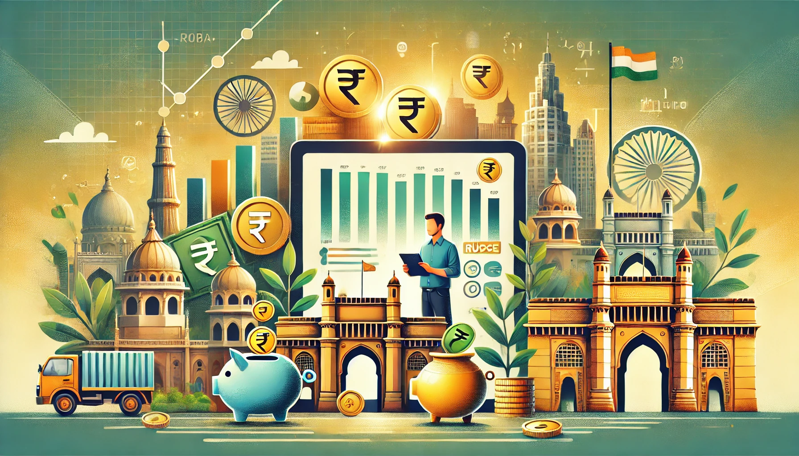

# 
 **🌟 Finanzas personales y hábitos de gasto en la India** 

## **RESUMEN**
Este proyecto explora los datos financieros y demográficos de 20,000 individuos en India, proporcionando valiosos conocimientos sobre la gestión financiera personal y los patrones de gasto que se dan en la India.

Utilizando conjuntos de datos detallados, el análisis se centra en atributos esenciales como ingresos, edad, dependientes, ocupación y nivel de ciudad. También examina los gastos mensuales en diversas categorías, objetivos financieros y ahorros potenciales. Un desafío clave fue la conversión de columnas numéricas a enteros para un análisis preciso.

## Descripción del Proyecto
Este proyecto tiene como objetivo analizar el mercado financiero y los hábitos de gasto en la India para proporcionar a los profesionales, especialmente aquellos interesados en la economía india, conocimientos prácticos sobre la gestión financiera personal y los habitos de gastos en la India para facilitar la toma de decisiones financieras acertadas en base a los datos.

## Tecnologías Utilizadas
- **Python** (Pandas, NumPy, Scikit-learn, Matplotlib, Seaborn)
- **Streamlit** (para la visualización interactiva)
- **Azure Machine Learning** (para la implementación del modelo predictivo)
- **GitHub** (para el control de versiones y documentación)

## Funcionalidades Clave
- Análisis visual de ingresos, gastos y ahorros por diferentes categorías.
- Predicción de ahorros basada en datos históricos y patrones identificados.
- Recomendaciones personalizadas para mejorar los hábitos de ahorro.
- Interfaz interactiva construida en Streamlit.

## Accede a la Aplicación
🔗 **[Proyecto India - Streamlit App](https://proyectoindia-zpkqpsbrcfnb3wghrw2v2a.streamlit.app/)**

## Conclusiones y Recomendaciones
El análisis realizado en este proyecto revela patrones significativos en los hábitos de ahorro de los individuos en la India. Se identifican diferencias clave en los niveles de ahorro según variables como edad, ocupación y nivel de ingresos. 

Algunas recomendaciones clave incluyen:
✅ Establecer un presupuesto mensual, asignando un porcentaje fijo al ahorro antes de destinarlo a otros gastos.  
✅ Reducir gastos en categorías no esenciales, priorizando necesidades sobre deseos.  
✅ Automatizar el ahorro, utilizando herramientas bancarias que transfieran automáticamente una parte del ingreso a cuentas de ahorro.  
✅ Optimizar los gastos fijos, buscando opciones más económicas en transporte, servicios públicos y alimentación.  
✅ Fomentar la educación financiera**, para mejorar la toma de decisiones económicas a largo plazo.  

----------------
## Contacto

    [Jose Luis Vázquez Vicario]
        Data Analyst | Biólogo
        LinkedIn: www.linkedin.com/in/jlvv
        Email: eljl2v@gmail.com
    [Bencomo Hernández Morales]
        Data Analyst | Técnico Contable
        LinkedIn: https://www.linkedin.com/in/bencomo-hernandez-morales
        Email: bencomo.hdez@gmail.com
    [Jorge Duro Sánchez]
        Data Analyst | Bioinformático | Biólogo Computacional
        LinkedIn: https://www.linkedin.com/in/jorge-duro-s%C3%A1nchez-694686230/
        Email: jorge.durosanchez@gmail.com
    
**
 This project is licensed under the MIT License 
**

