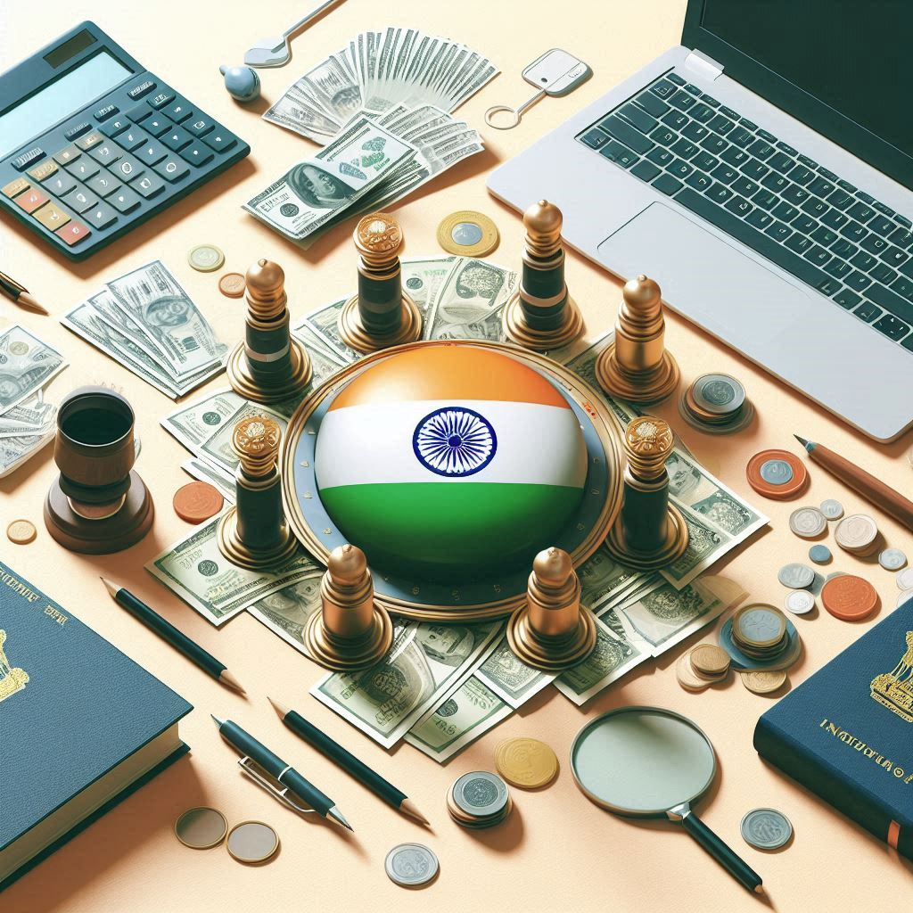

# 
 **Finanzas personales y hábitos de gasto en la India** 

----------------

    [Jose Luis Vázquez Vicario]
        Data Analyst | Biólogo
        LinkedIn: www.linkedin.com/in/jlvv
        Email: eljl2v@gmail.com
    [Bencomo Hernández Morales]
        Data Analyst | Técnico Contable
        LinkedIn: https://www.linkedin.com/in/bencomo-hernandez-morales
        Email: bencomo.hdez@gmail.com
    [Jorge Duro Sánchez]
        Data Analyst | Bioinformático | Biólogo Computacional
        LinkedIn: https://www.linkedin.com/in/jorge-duro-s%C3%A1nchez-694686230/
        Email: jorge.durosanchez@gmail.com
    
**
 This project is licensed under the MIT License 
**

    

## **RESUMEN**
Este proyecto explora los datos financieros y demográficos de 20,000 individuos en India, proporcionando valiosos conocimientos sobre la gestión financiera personal y los patrones de gasto que se dan en la India.

Utilizando conjuntos de datos detallados, el análisis se centra en atributos esenciales como ingresos, edad, dependientes, ocupación y nivel de ciudad. También examina los gastos mensuales en diversas categorías, objetivos financieros y ahorros potenciales. Un desafío clave fue la conversión de columnas numéricas a enteros para un análisis preciso.

Los hallazgos revelan patrones y tendencias significativas en ingresos, gastos y ahorros, ofreciendo una base sólida para comprender el comportamiento financiero personal en diferentes segmentos demográficos.

**Palabras clave:** finanzas personales, análisis de datos, ingresos, gastos, ahorros, demografía, India.

## **OBJETIVO**
Este proyecto tiene como objetivo analizar el mercado financiero y los hábitos de gasto en la India para proporcionar a los profesionales, especialmente aquellos interesados en la economía india, conocimientos prácticos sobre la gestión financiera personal y los habitos de gastos en la India para facilitar la toma de decisiones financieras acertadas en base a los datos.

Al examinar factores clave como ingresos, edad, dependientes, ocupación y nivel de ciudad, así como los gastos mensuales en diversas categorías, objetivos financieros y ahorros potenciales, el análisis revela patrones y tendencias que influyen en la gestión financiera. Se emplean técnicas de análisis de datos y visualización para asegurar un conjunto de datos completo y confiable.
